<!DOCTYPE html>
<html lang="es">
<head>
    <meta charset="UTF-8">
    <meta name="viewport" content="width=device-width, initial-scale=1.0">
</head>
<body>

    <h1>🧬 Segmentación de Imágenes Médicas con Algoritmos Bio-inspirados 🧬</h1>
    

        <strong>Implementación de técnicas de umbralización multinivel utilizando Mealpy.</strong>
    

<h2>📖 Descripción del Proyecto</h2>

    Este proyecto automatiza la segmentación de imágenes médicas mediante algoritmos bio-inspirados de la librería <strong>Mealpy</strong>. Permite evaluar múltiples algoritmos, funciones objetivo (Kapur, Otsu, Tsallis) y dimensiones de umbralización, generando reportes detallados y visualizaciones comparativas.

<h3>🤖 Algoritmos Bio-inspirados (Mealpy)</h3>
<ul>
    <li><strong>TSO</strong>: Tuna Swarm Optimization</li>
    <li><strong>HBA</strong>: Honey Badger Algorithm</li>
    <li><strong>BES</strong>: Bald Eagle Search</li>
    <li><strong>GWO</strong>: Grey Wolf Optimizer</li>
    <li><strong>HHO</strong>: Harris Hawks Optimization</li>
    <li><strong>CSA</strong>: Crow Search Algorithm</li>
    <li><strong>WOA</strong>: Whale Optimization Algorithm</li>
    <li><strong>SCSO</strong>: Sand Cat Swarm Optimization</li>
</ul>

<em>Nota: Se utilizan WOA y SCSO en reemplazo de RSA y OPA por compatibilidad con la versión actual de Mealpy.</em>

<h2>🚀 Instalación y Uso</h2>

<h3>1. Prerrequisitos e Instalación</h3>

Se recomienda usar <strong>Conda</strong> para gestionar el entorno virtual y asegurar la compatibilidad de las librerías.

<h4>Flujo de Instalación Completo</h4>
<pre><code># 1. Crear entorno virtual (Python 3.10 recomendado)
conda create -n ML python=3.10 -y

# 2. Activar el entorno
conda activate ML

# 3. Instalar dependencias desde requirements.txt
pip install -r requirements.txt</code></pre>

<h3>2. Configuración Personalizada</h3>

El archivo <code>src/configuracion.py</code> actúa como centro de control. Puedes editarlo para ajustar:

<ul>
    <li><strong>Dimensiones</strong>: <code>DIMENSIONS_LIST = [5, 6, 7, 8, 9]</code></li>
    <li><strong>Población e Iteraciones</strong>: Ajustar <code>N</code> y <code>T</code> según la potencia de cómputo.</li>
    <li><strong>Funciones Objetivo</strong>: <code>['Kapur', 'Tsallis', 'Otsu']</code></li>
</ul>

<h3>3. Ejecución</h3>

El punto de entrada es <code>main.py</code>. Al ejecutarlo, se solicitará seleccionar el modo de operación:

<pre><code>python main.py</code></pre>

<ul>
    <li><strong>Opción 1: MODO TEST (Rápido)</strong>
        <ul>
            <li>Procesa solo las primeras 2 imágenes.</li>
            <li>Dimensiones bajas (3D, 4D).</li>
            <li>Pocas iteraciones y población reducida (ideal para verificar que todo funciona).</li>
        </ul>
    </li>
    <li><strong>Opción 2: MODO PRODUCCIÓN (Completo)</strong>
        <ul>
            <li>Procesa todas las imágenes de la carpeta <code>img/</code>.</li>
            <li>Ejecuta todas las dimensiones y configuraciones completas definidas en <code>src/configuracion.py</code>.</li>
        </ul>
    </li>
</ul>

<h2>📂 Estructura de Resultados</h2>

    Todos los resultados se guardan automáticamente en la carpeta <code>Resultados/</code>, dentro de una subcarpeta con marca de tiempo única (ej. <code>20250115_120000_PROD</code>).

<h3>Archivos Generados:</h3>
<ol>
    <li><strong>Excel por Dimensión</strong>: <code>Resultados_Kapur_7dim.xlsx</code> (Métricas detalladas por imagen y algoritmo).</li>
    <li><strong>Numpy Arrays</strong>: Archivos <code>.npy</code> con los umbrales crudos y curvas de convergencia para análisis posterior.</li>
    <li><strong>Visualización</strong>:
        <ul>
            <li>Carpeta <code>Visualizacion/</code> dentro de cada dimensión.</li>
            <li>Contiene <em>collages</em> comparativos mostrando la imagen original junto a las segmentaciones logradas por cada algoritmo.</li>
        </ul>
    </li>
    <li><strong>Consolidado</strong>: <code>Resultados_Consolidados.xlsx</code> en la raíz de la ejecución, uniendo toda la data de todas las funciones y dimensiones.</li>
</ol>

<h2>⚙️ Funciones Objetivo Implementadas</h2>

<h3>1. Entropía de Kapur</h3>

Maximiza la entropía de las clases separadas por los umbrales. Busca la mayor información contenida en la distribución del histograma.

    

<h3>2. Método de Otsu</h3>

Maximiza la varianza entre clases ($\sigma_B^2$) para separar distribuciones de intensidad, asumiendo que la imagen contiene dos clases de píxeles (fondo y primer plano) o múltiples clases en el caso multinivel.

    

<h3>3. Entropía de Tsallis</h3>

Generalización de la entropía para sistemas no extensivos (parámetro $q$). Es especialmente útil para imágenes con estructuras complejas y dependencias de largo alcance.

    

<h2>🖼️ Dataset y Soporte DICOM</h2>

    El sistema es capaz de procesar imágenes médicas en múltiples formatos ubicadas en la carpeta <code>img/</code>.

<h3>Formatos Soportados</h3>
<ul>
    <li><strong>Imágenes Estándar</strong>: <code>.png</code>, <code>.jpg</code>, <code>.jpeg</code>.</li>
    <li><strong>Imágenes Médicas (DICOM)</strong>: <code>.dcm</code>.</li>
</ul>

<h3>🔄 Conversión Automática DICOM</h3>

    El sistema incluye un módulo de preprocesamiento inteligente que detecta archivos DICOM y los convierte automáticamente:

<ul>
    <li><strong>Preservación de Calidad</strong>: Conversión a PNG de <strong>16-bits</strong> para mantener el rango dinámico completo de la imagen médica original.</li>
    <li><strong>Metadatos</strong>: Se extrae información clave (TE, TR, espaciado de píxeles) y se guarda en archivos JSON adjuntos.</li>
    <li><strong>Transparencia</strong>: Las imágenes convertidas se guardan en la misma carpeta y se integran automáticamente al flujo de segmentación sin intervención del usuario.</li>
</ul>

    
    
    
    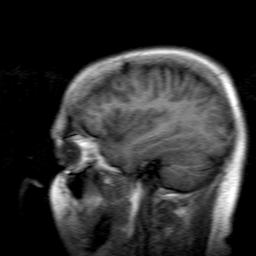
    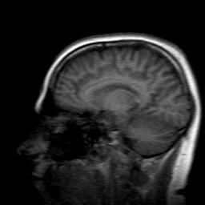
    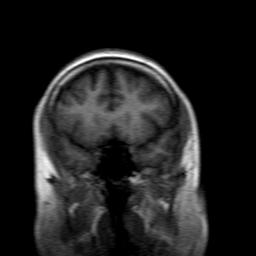
    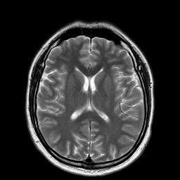
    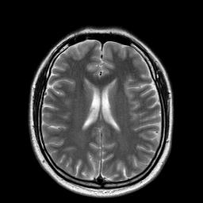
    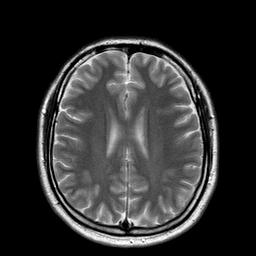
    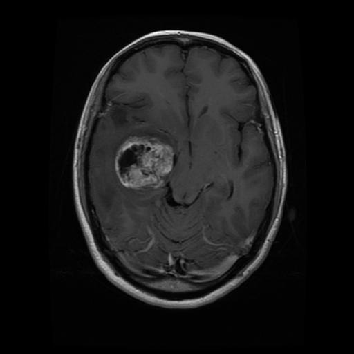
    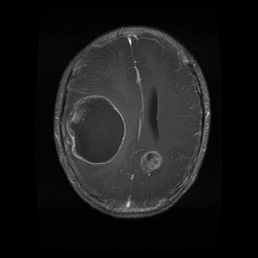
    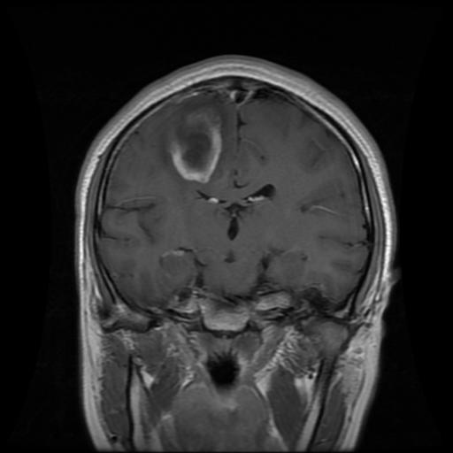
    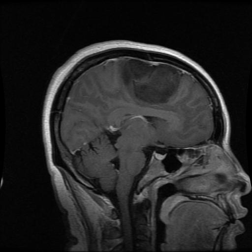
    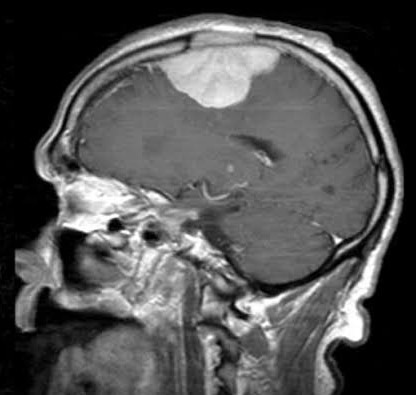
    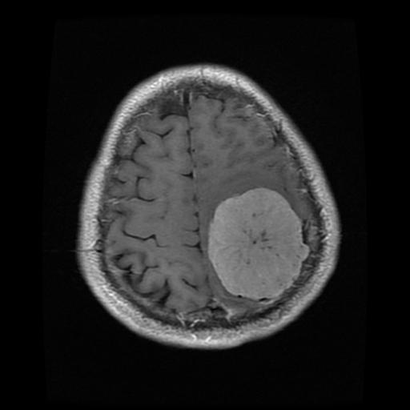
    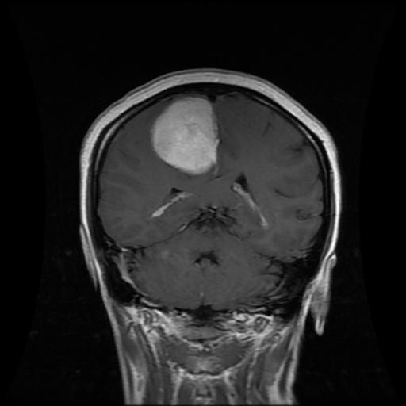
    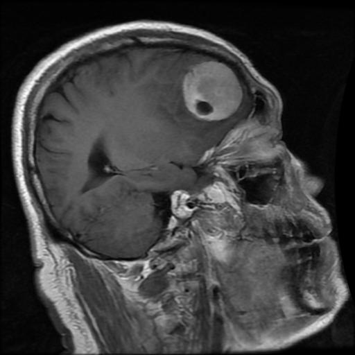
    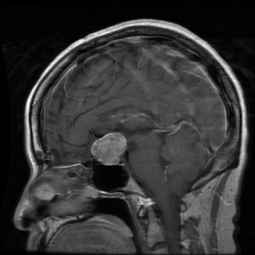
    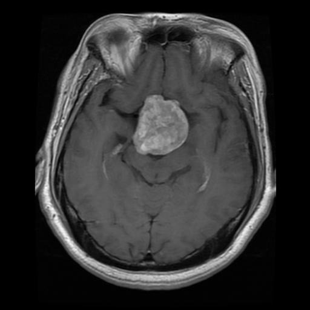
    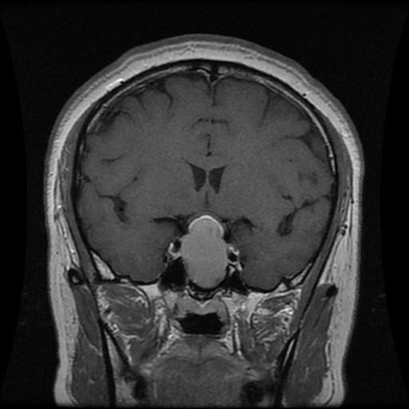

<h2>📊 Ejemplos de Resultados (Segmentación)</h2>

    A continuación se muestran ejemplos de las matrices de segmentación generadas automáticamente.

### Kapur (4 Dimensiones)
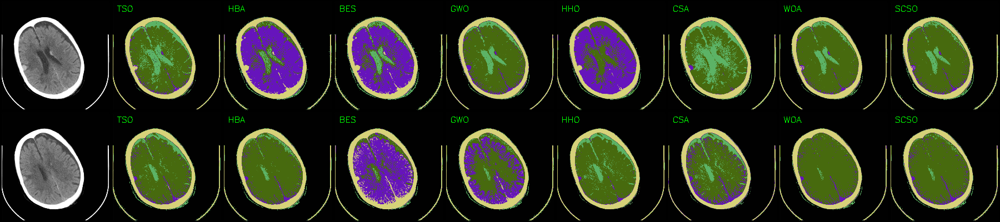

### Tsallis (4 Dimensiones)
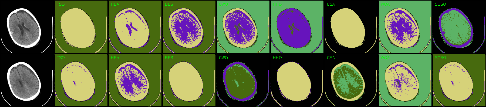

### Otsu (4 Dimensiones)
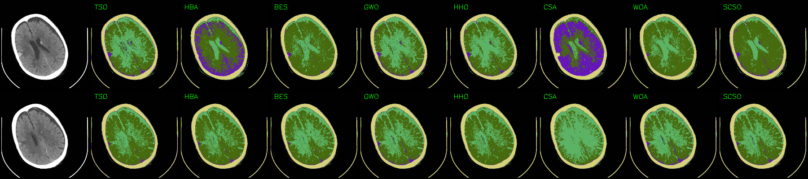

<h2>📚 Referencias y Recursos</h2>

<h3>🔗 Recursos Adicionales</h3>
<ul>
    <li>
        <strong>Figshare (Imágenes y Gráficos Complementarios):</strong> 
        <a href="https://doi.org/10.6084/m9.figshare.25709067" target="_blank">https://doi.org/10.6084/m9.figshare.25709067</a>
    </li>
</ul>

<h3>📄 Artículos y Datos (BibTeX)</h3>
<pre><code>@misc{Tasnia2023, 
   author = {Noshin Tasnia}, 
   title = {Brain Stroke Prediction CT Scan Image Dataset [Conjunto de datos]}, 
   year = {2023}, 
   publisher = {Kaggle}, 
   howpublished = {\url{https://www.kaggle.com/datasets/noshintasnia/brain-stroke-prediction-ct-scan-image-dataset/data}}, 
   note = {Accedido el 27 de abril de 2024} 
} 

@misc{TrainingDataPro2024, 
   author = {{Training Data Pro}}, 
   title = {DICOM Brain Dataset [Conjunto de datos]}, 
   year = {2024}, 
   publisher = {Kaggle}, 
   howpublished = {\url{https://www.kaggle.com/datasets/trainingdatapro/dicom-brain-dataset}}, 
   note = {Accedido el 27 de abril de 2024} 
} 

@misc{Nickparvar2024, 
   author = {Masoud Nickparvar}, 
   title = {Brain Tumor MRI Dataset [Conjunto de datos]}, 
   year = {2024}, 
   publisher = {Kaggle}, 
   howpublished = {\url{https://www.kaggle.com/datasets/masoudnickparvar/brain-tumor-mri-dataset}}, 
   note = {Accedido el 27 de abril de 2024} 
}</code></pre>

</body>
</html>
